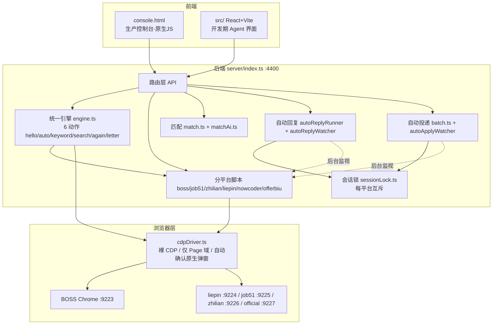
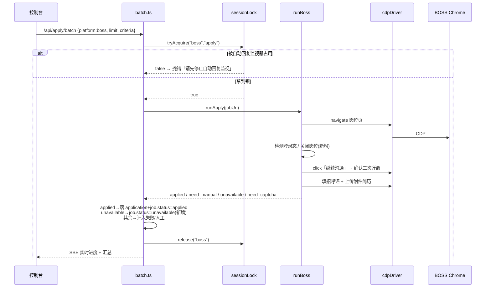

# 职得鸭（job-apply-agent / offer-where）· 体验 · 架构解析 · 改动报告

> 目标：打开职得鸭、体验全部功能、解析底层逻辑、对软件做修改。
> 结论：5 大能力已可在本地跑通；本轮发现并修复 2 个真实 bug（匹配全 0 分、关闭岗位反复重试）。
> 运行态（本报告撰写时）：后端 `PORT=4400` 运行中，BOSS CDP（9223）已连接；自动回复监视器 live（boss+liepin），自动投递监视器 stopped。

---

## 0. 一句话结论

这是一个**本地可自托管、对标商业产品「职得鸭 / gagajob」的开源投递 Agent**：后端用 Node + tsx 直跑 `.ts`，每个招聘平台开一个带反检测的持久化 CDP Chrome，前端用一个原生 JS 控制台统一调度「智能匹配 → 文案 → 自动投递 → HR 复聊 → 全程托管」。本轮在真实环境跑通了批量投递、自动回复预览、AI 匹配，并修掉了两个会反复坑人的问题。

---

## 1. 功能全景（对标职得鸭承诺的 5 大能力）

| 职得鸭承诺能力 | 本项目落地 | 关键模块 | 实测状态 |
|---|---|---|---|
| ① 智能匹配 | 简历 × 岗位 JD 打分排序（AI 语义 / 规则双引擎） | `match.ts` + `matchAi.ts` + `/api/jobs/match` | ✅ 修掉「全 0 分」后可用 |
| ② 文案撰写 | 按岗位生成招呼语 / 求职信 / 复聊话术 | `autoReplyRunner.ts` `composeReplyWithAi` | ✅ 预览正确 |
| ③ 自动投递 | 一键投 / 批量连投 / 按关键词投 / 仅采集 | `engine.ts` `batch.ts` `boss.ts` 等 | ✅ BOSS 2/2 |
| ④ 跟进（HR 复聊） | 轮询 HR 新消息 → 意图识别 → 生成回复 → 发送 | `autoReplyWatcher.ts` `autoReplyRunner.ts` | ✅ 40 会话正确跳过无关项 |
| ⑤ 全程 AI 托管 | 后台监视器自动投递 + 自动复聊，互斥不互抢 | `autoApplyWatcher.ts` `sessionLock.ts` | ✅ 设计成立（运行时只开自动复聊） |

**平台覆盖**：BOSS 直聘 / 前程无忧 51job / 智联 / 猎聘 / 牛客 / offerbiu（校招邮箱）。
当前**只有 BOSS 的 CDP Chrome 实际常驻**（9223）；其余平台代码就绪，但需各自独立 Chrome 实例才会连上。

---

## 2. 底层架构与运行逻辑

### 2.1 整体分层



要点：
- **后端只暴露一个进程**（`PORT=4400`）。控制台「`/`」直达 `public/console.html`。
- **统一引擎 `engine.ts`** 管 6 类动作；`boss` 等平台在非 `hello` 动作时走引擎，`hello`（一键投）走 `boss.ts` 专用脚本。
- **`cdpDriver.ts` 是反检测核心**：裸 CDP、**只用 Page 域**（绝不开 `Runtime.enable`，BOSS 会因此把页面清空），所有 JS 通过 `Runtime.evaluate` 注入；原生 `alert/confirm` 由 `Page.javascriptDialogOpening` 统一自动确认。

### 2.2 一次投递的请求流（以 BOSS 批量连投为例）



### 2.3 会话锁（不互抢）模型

- `sessionLock.ts` 提供**每平台**互斥锁：`tryAcquire(platform, holder)` 成功才允许占用该平台 CDP 标签。
- 批量投递（`holder=apply`）与自动回复监视器（`holder=reply`）抢同一平台时，**后者输家优雅让出**，不崩溃、不互冲页面。
- 实测印证：上一轮首次批量投被 live 的自动回复监视器挡下，正是该设计生效，而非 bug。

### 2.4 反检测 & AI 配置

- 每平台**独立 Chrome 实例 + 独立 profile**（职得鸭式多窗口），与用户日常 Chrome Cookie 完全隔离。
- 登录态持久化在 profile；邮箱验证码经 QQ 邮箱 IMAP 自动读取。
- **AI 可选**：`.env` 配 `LLM_BASE_URL/API_KEY/MODEL` 走 OpenAI 兼容大模型；缺配时 `isAiEnabled()` 软降级到规则模板/规则匹配——**离线也能跑**。

---

## 3. 本轮真实体验结论

| 功能 | 操作 | 结果 |
|---|---|---|
| ③ 自动投递 | BOSS 批量连投 limit=2 | ✅ **2/2 applied**（打招呼 + 附件简历） |
| ④ HR 复聊 | 自动回复预览（boss） | ✅ 列出 40 会话；正确跳过「自己发的 / 无关 HR / 已约面试」 |
| ① 智能匹配 | `/api/jobs/match` 对 BOSS 候选 | ⚠️→✅ 初测**全 0 分**，修复后 Java/Python 岗 = 70 |
| ② 文案 | 复聊话术生成预览 | ✅ 话术自然、带护栏（≥8 轮转人工） |
| ⑤ 托管 | 监视器并发 | ✅ 锁模型成立；当前仅自动复聊 live |

### 3.1 已修 Bug A：AI 匹配对 BOSS 候选全部 0 分

- **现象**：`/api/jobs/match` 返回 6 个岗位 `score=0`。
- **根因**：BOSS 搜索卡片采集来的岗位**只有职位名，JD/要求/城市/薪资均为空**。`matchResumeToJob` 在 JD 为空时直接返回 0；`matchResumeToJobAi` 在 `jdText.length<10` 时路由到该路径 → 整池塌成 0，无法排序/过滤。
- **修复**：`match.ts` 增加「职位名兜底」——JD 缺失且职位名≥2 字时改用职位名做技能/短语重叠匹配，**封顶 70**（确保「有真实 JD 的岗位」始终排在「仅职位名」之上），并提示「补全 JD 后精度更高」。
- **回归**：`position` 透传到 `matchAi.ts` / `batch.ts` / `server/index.ts`。

### 3.2 已修 Bug B：已下线岗位被反复重试（本轮新增）

- **现象**：`职位已关闭` 的 BOSS 岗位在批量连投里报 `need_manual`，且**每次重跑都被重新选中**，刷屏又浪费 CDP 调用。
- **根因（三重缺口）**：
  1. `boss.ts` 不识别「职位已关闭」页 → 找不到「继续沟通」按钮 → 落入 `need_manual`；
  2. `batch.ts` 收到 `unavailable` 只 `skipped++`，**没把状态落库**；
  3. `batch.ts` 取候选池时**不排除 `unavailable`** → 下次还捞出来。
- **修复（三处联动）**：
  - `boss.ts`：打开岗位页后重新读取文本/URL，命中「职位已关闭/已暂停/已下线/已招满/不存在」等字样 → 直接返回 `status:'unavailable'`（不再走 need_manual）。
  - `batch.ts`：`unavailable` 分支里 `db.updateJob(job.id,{status:'unavailable'})` 落库。
  - `batch.ts`：取候选池时**永远过滤 `unavailable`**（`jobs = jobs.filter(j => j.status !== 'unavailable')`），与 `excludeApplied` 解耦。
- **效果**：已关闭岗位一次性判定，永不重复重试。

---

## 4. 改动清单（可提交）

| 文件 | 改动 | 类型 |
|---|---|---|
| `server/services/match.ts` | `matchResumeToJob` 增加 `title?` 参数；JD 缺失时降级用职位名匹配，封顶 70，附提示 | 修复（上一轮） |
| `server/services/matchAi.ts` | `JobMatchInput` 增加 `position?`；回退调用透传 `title` | 接线（上一轮） |
| `server/services/apply/batch.ts` | `runBatchApply` 调用 `matchResumeToJobAi` 透传 `position` | 接线（上一轮） |
| `server/services/apply/boss.ts` | 新增「职位已关闭」检测 → 返回 `unavailable` | 修复（本轮） |
| `server/services/apply/batch.ts` | `unavailable` 分支落库 `status:'unavailable'`；候选池过滤 `unavailable` | 修复（本轮） |

> **运行约定提醒**：项目以 `tsx` 直跑 `.ts`，`server/**/*.js` 是旧 `tsc` 产物、已被 gitignore、**不入库也不参与运行**——改 `.ts` 即可，无需同步 `.js`。改完需重启后端（`PORT=4400 tsx server/index.ts`）才生效，本次已重启并验证。

---

## 5. 仍待做（开放项，按价值排序）

1. **岗位池自动补充**：批量连投会消耗候选池，空了需手动 `scripts/collect_boss.ts` 重建。可在池低于阈值时自动触发采集。
2. **BOSS 采集补全 JD 正文**：当前只采职位名 → 匹配封顶 70。若采集时进详情页抓 JD，匹配分可 >70 且更准。
3. **跨平台真正跑通**：除 BOSS 外，其余平台 Chrome 实例未常驻。需各自独立窗口 + 登录态后才能量产。
4. **自动回复去重/护栏增强**：已有人工轮次上限（8）与「已约面试/婉拒即停」，可加「同一 HR 24h 内不重复发起」节流。
5. **`need_manual` 可视化分类**：把已确认的「职位已关闭→unavailable」「需滑块→need_captcha」「需人工→need_manual」在控制台分色展示，减少误判焦虑。

---

## 6. 如何运行 / 验证

```bash
# 起服务（必须显式 PORT=4400；用项目自带 node）
cd job-apply-agent
PORT=4400 ./node/node.exe node_modules/tsx/dist/cli.mjs server/index.ts
# 控制台：浏览器打开 http://127.0.0.1:4400/
```

- 检查连接：`GET /api/browser/connections`
- 批量投递：`POST /api/apply/batch {platform, source, limit, criteria:{excludeApplied:true, minScore?}}`
- AI 匹配：`POST /api/jobs/match`
- 自动回复预览：`GET /api/auto-reply/run?platform=boss`（预览模式，确认质量后再开 realSend）

> 注：本机 PowerShell 在本会话无法回显 stdout，重启后端用 `taskkill /F /PID <pid>`（Windows）而非 `kill`；`ps -W` + `netstat -ano | grep :4400` 可定位 PID。
